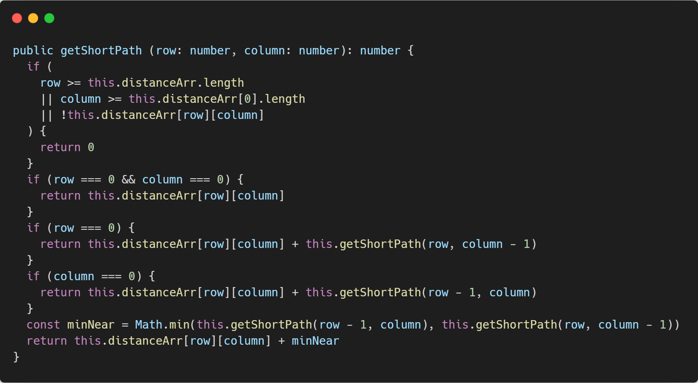

# Dynamic Planning——动态规划

- 最短路径（Short Path）
- 硬币找零（Coin Settle）

### 最短路径

#### 问题描述

根据正整数m x n网格，找到一条从左上角到右下角的最小路径

#### 问题分析

每格网格最小路径为当前网格路径长度 + 上方或左边最小距离，根据递归最终获取左上角到当前网格的最短路径。

根据上方思路客分析出最终的递推公式：
$$
`minPath(m, n) = distance(m, n) + min(minPath(m - 1, n), minPath(m, n -1))`
$$

